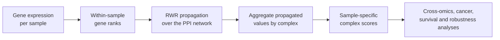

# NetComplex

### Estimating protein complex expression across transcriptomic and proteomic data

R and Python analysis code accompanying the NetComplex study

This repository provides the scripts used to calculate and evaluate sample-specific protein-complex scores from gene-expression data. It accompanies the manuscript **“NetComplex: estimating protein complex expression across transcriptomic and proteomic data”** by Zihao Chen, Zhifeng Wang, and Dmitrij Frishman.

## Contents

[Overview](#overview) · [Method](#method) · [Analyses](#analyses) · [Repository map](#repository-map) · [Reproducibility](#reproducibility) · [Manuscript](#manuscript)

## Overview

NetComplex combines within-sample gene-expression ranks, propagation over a protein–protein interaction (PPI) network, and curated protein-complex membership to estimate the expression of protein complexes in individual samples.

| Evaluation | Scope |
| --- | --- |
| Cross-omics concordance | 10 CPTAC tumor cohorts; 1,023 matched RNA–proteome samples |
| Tumor analyses | Tumor–normal discrimination and tumor-only pan-cancer analyses across 14 cancer types |
| Survival prediction | Leave-one-dataset-out evaluation across 76 cohorts and 12 cancer types |
| Robustness | Alternative PPI resources and complex annotations; parameter, propagation, cohort-composition, and expression-noise analyses |
| Additional applications | Single-cell benchmarks, matched RNA–protein survival clustering, runtime benchmarks, and case studies |

## Method

For each sample, genes are rank-normalized within its expression profile. These ranks are propagated on an unweighted PPI network using random walk with restart (RWR; default restart parameter α = 0.3). The propagated values of the available members are then averaged to produce a score for each complex. The default resources are STRING for the PPI network and CORUM for complex membership. Genes not present in the PPI network are retained as isolated nodes and keep their input ranks.

Bulk analyses compare NetComplex with Mean, Min, ZScore, GSVA, ssGSEA, PLAGE, NetMean, and PerPAS. Single-cell analyses additionally include AUCell and UCell.

## Analyses

The numbered directories group the analyses reported in the accompanying manuscript:

- **Cross-omics and cancer cohorts:** matched RNA–proteome concordance, random-complex controls, model ablations, TCGA tumor–normal discrimination, and tumor-only pan-cancer analyses.
- **Survival and robustness:** leave-one-dataset-out survival prediction, alternative PPI and complex resources, complex-size strata, restart and propagation sensitivity, cohort-composition stability, and expression-noise perturbations.
- **Single-cell and applications:** analyses of GSE96583 and GSE226572, RNA–protein survival clustering, runtime benchmarking, and TCGA-KIRC and single-cell case studies.

## Repository map

| Directory | Contents |
| --- | --- |
| [`00data/`](00data/) | Preparation scripts for complex annotations, PPI resources, CPTAC and TCGA expression data, and single-cell datasets |
| [`01protein/`](01protein/) | CPTAC cross-omics benchmark, random-complex controls, alternative PPI analyses, and supporting summaries |
| [`02TCGAnt/`](02TCGAnt/) | TCGA matched tumor–normal analysis |
| [`02TCGAt/`](02TCGAt/) | TCGA tumor-only pan-cancer analysis |
| [`03Survival/`](03Survival/) | Cross-cohort leave-one-dataset-out survival prediction and plotting |
| [`04ComplexPortal/`](04ComplexPortal/) | Robustness analysis using Complex Portal annotations |
| [`04complexSize/`](04complexSize/) | Complex-size-stratified analysis |
| [`04parameter/`](04parameter/) | Restart-parameter sensitivity analysis |
| [`04propagation/`](04propagation/) | Propagation-depth and network-topology sensitivity analyses |
| [`05independence/`](05independence/) | Cohort-composition stability analysis |
| [`05noise/`](05noise/) | Expression-noise robustness analysis |
| [`06singleCell/`](06singleCell/) | Single-cell benchmarks and ablations for GSE96583 and GSE226572 |
| [`07multi/`](07multi/) | Matched RNA–protein rank fusion and multilayer scoring with survival clustering |
| [`08runtime/`](08runtime/) | Runtime scaling analyses for bulk and single-cell data |
| [`09TCGAstudy/`](09TCGAstudy/) | TCGA-KIRC tumor–normal and survival case study |
| [`10Cellstudy/`](10Cellstudy/) | Single-cell case study and supporting analyses |
| [`function/`](function/) | Shared NetComplex implementation and comparator scoring functions |

## Reproducibility

This repository contains analysis scripts; the underlying expression matrices, clinical data, PPI files, complex tables, and generated results are not included. The analyses use public resources described in the manuscript, including CPTAC, TCGA/GDC, GEO, ArrayExpress, cBioPortal, CORUM, STRING, BioGRID, HuRI, and Complex Portal. Data acquisition is not automated here, so the required inputs must be obtained separately.

Before running an analysis, note that:

- Some scripts use absolute paths from the original computing environment, including `/proj/c.zihao/work3/` and `/proj/c.zihao/work2/1pathway/`; update these paths for your environment.
- Scripts are arranged in numbered, analysis-specific stages. Required inputs and execution order vary by branch; there is no single project-wide launcher.
- No environment lockfile is provided. The core Python implementation requires Python 3.9 or later and uses NumPy, pandas, SciPy, and NetworkX. Individual analyses may require additional Python or R packages.

## Manuscript

**NetComplex: estimating protein complex expression across transcriptomic and proteomic data**  
Zihao Chen, Zhifeng Wang, and Dmitrij Frishman

The analysis code is available at [github.com/bioUroZC/NetComplex-analysis](https://github.com/bioUroZC/NetComplex-analysis).
